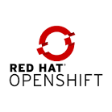

# Onboarding an Openshift cluster to Check Point Cloudguard CSPM (ex.Dome9)

                           


Please go to the CloudGuard asset onboarding page in cloudguard then pick Kubernetes...enter the cluster name, namespace name and your cloudguard API token then click next && pick an organization then next && then STOP... 

#### Enter the command below in your openshift cluster:


> IMPORTANT: Please do NOT use the Helm charts or manual option kubectl comnands as this is for OpenShift which uses oc command to manasge the K8s cluster. Openshift implementation has different values with regards to deployments config paramaters vs traditional K8s. The deployment file and some other commands had to be customized for OpenShift

#### Please install Git to clone the repo and download the deployment config yaml file for OpenShift

### Run the following command:
```
git clone git@github.com:chkp-dhouari/cloudguard-OpenShift.git
```

### Run the following command (only for new namespace)

```
oc create namespace
```

## PLEASE REPLACE <your_namespace> with your namespace name that you created after the --namespace flag!

### Create a CloudGuard token or use an existing one and add to your cluster secrets
#### You can copy from the onboard page or just copy you cloudguard credentials here again:

```
oc create secret generic dome9-creds --from-literal=username=<cloudguard_API_key> --from-literal=secret=<cloudguard_secret_key> --namespace <your_namespace>
```

### Create a configmap to hold the clusterID
#### please copy your cluster id from the the kubectl equivalent command that is automatically generated in the onboarding page

```
oc create configmap cp-resource-management-configmap --from-literal=cluster.id=,your_cluster_id> --namespace <your_namespace>
```

### Run the following commands

```
oc create serviceaccount cp-resource-management --namespace <your_namespace>
```

### The cloudguard agent uses the user ID 1000 whereas the Openshift security context constraint or scc assign a randown UID from a range which will cause the replicaset to fail to deploy the agent. We need to create a Security Context Constraint or scc for CloudGuard in OpenShift and allow the UID 1000:

## To allow cloudguard to use UID 1000, please create a file uid1000.json containing:

#### NOTE:with OpenShift 4.x and above the apiVersion has changed to security.openshift.io/v1. Please do update that if you are running v4.x and above

```
{
    "apiVersion": "v1",
    "kind": "SecurityContextConstraints",
    "metadata": {
        "name": "uid1000"
    },
    "requiredDropCapabilities": [
        "KILL",
        "MKNOD",
        "SYS_CHROOT",
        "SETUID",
        "SETGID"
    ],
    "runAsUser": {
        "type": "MustRunAs",
        "uid": "1000"
    },
    "seLinuxContext": {
        "type": "MustRunAs"
    },
    "supplementalGroups": {
        "type": "RunAsAny"
    },
    "fsGroup": {
        "type": "MustRunAs"
    },
    "volumes": [
        "configMap",
        "downwardAPI",
        "emptyDir",
        "persistentVolumeClaim",
        "projected",
        "secret"
    ]
}

```

### Need to create a new SCC for CloudGuard, you need to be an administrator.

```
$ oc create -f uid1000.json --as system:admin
securitycontextconstraints "uid1000" created

```
### Set the SCC to be used by the cloudguard service account that we already created 

```
$ oc adm policy add-scc-to-user uid1000 -z cp-resource-management --as system:admin
```

### Run the following commands
```
oc create clusterrole cp-resource-management --verb=get,list --resource=pods,nodes,services,nodes/proxy,networkpolicies.networking.k8s.io,ingresses.extensions,podsecuritypolicies,roles,rolebindings,clusterroles,clusterrolebindings,serviceaccounts,namespaces
```

```
oc create clusterrolebinding cp-resource-management --clusterrole=cp-resource-management --serviceaccount=prod:cp-resource-management
```

### Deploy CloudGuard agent

```
oc create -f cp-cloudguard-openshift.yaml --namespace=<your_namespace>
```

then next and wait for agent to be synced

Start running compliance on your OC cluster
